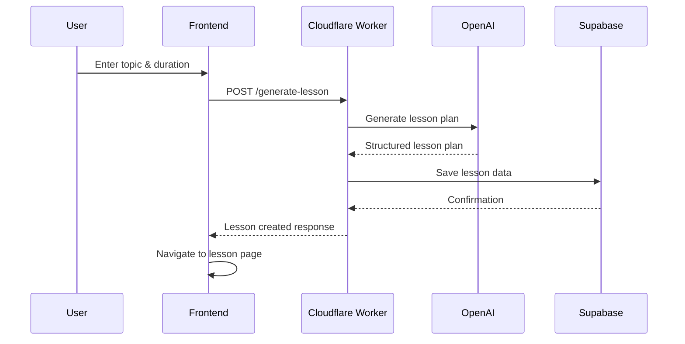
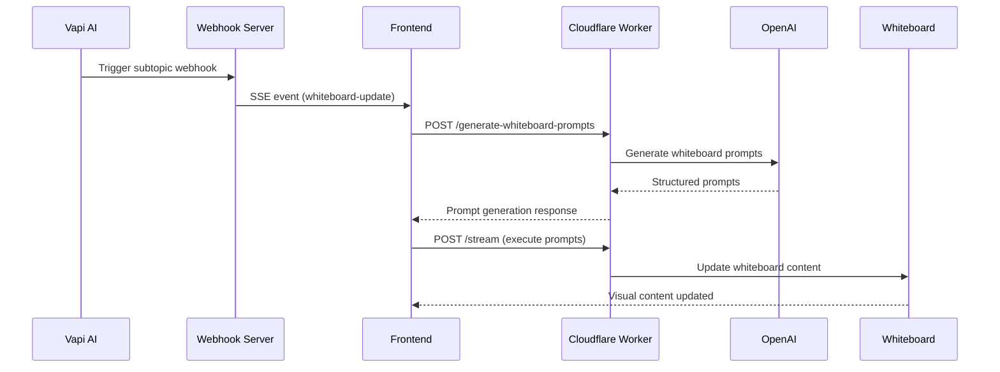
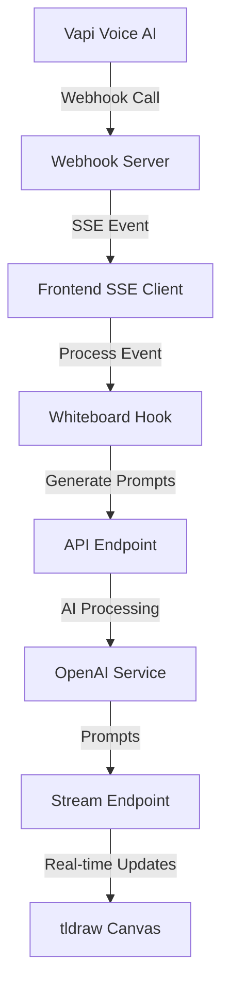

# Tutorix Technical Documentation

## Table of Contents

1. [Architecture Overview](#architecture-overview)
2. [System Components](#system-components)
3. [API Endpoints](#api-endpoints)
4. [Data Flow](#data-flow)
5. [State Management](#state-management)
6. [Real-time Communication](#real-time-communication)
7. [AI Integration](#ai-integration)
8. [Database Schema](#database-schema)
9. [Configuration](#configuration)
10. [Development Setup](#development-setup)
11. [Deployment](#deployment)

## Architecture Overview

Tutorix is a **multi-agent AI tutoring system** built on a modern serverless architecture. The system consists of three main layers:

### Frontend Layer
- **React 18** with TypeScript for type safety
- **tldraw** for interactive whiteboard functionality
- **Vapi Web SDK** for voice AI integration
- **Tailwind CSS** for styling

### Backend Layer
- **Cloudflare Workers** for serverless API endpoints
- **Durable Objects** for state management
- **OpenAI API** for AI-powered content generation
- **Supabase** for data persistence

### Integration Layer
- **Server-Sent Events (SSE)** for real-time updates
- **Webhook system** for agent coordination
- **WebRTC** for voice communication (via Vapi)

## System Components

### 1. Frontend Components

#### Core Pages
- **HomePage** (`client/pages/HomePage.tsx`)
  - Topic input and lesson configuration
  - Lesson generation trigger
  - Navigation to lesson page

- **LessonPage** (`client/pages/LessonPage.tsx`)
  - Interactive whiteboard (tldraw canvas)
  - Vapi voice AI integration
  - SSE connection management
  - Real-time whiteboard updates

- **TestPage** (`client/pages/TestPage.tsx`)
  - Development testing interface
  - Webhook testing utilities
  - Whiteboard prompt testing

#### Key Components
- **VapiWidget** (`client/components/vapi-widget.tsx`)
  - Voice AI control interface
  - Call management
  - Audio controls

- **SimpleWhiteboardStatus** (`client/components/SimpleWhiteboardStatus.tsx`)
  - Processing status display
  - Progress tracking
  - Error handling UI

### 2. Backend Services

#### API Routes (`worker/routes/`)
- **generate-lesson.ts** - Lesson plan generation
- **generate-whiteboard-prompts.ts** - Whiteboard content generation
- **get-lesson.ts** - Lesson data retrieval
- **stream.ts** - Real-time AI streaming
- **generate.ts** - General AI generation

#### Durable Objects (`worker/do/`)
- **TldrawAiDurableObject.ts** - Persistent whiteboard state
- **positioning/** - Layout management
- **grid/** - Grid system for content positioning
- **openai/** - AI service integration
- **custom/** - Custom whiteboard operations

### 3. Custom Hooks

#### State Management Hooks
- **useSimpleWhiteboard** (`client/hooks/useSimpleWhiteboard.ts`)
  - Core whiteboard functionality
  - Prompt processing pipeline
  - Session management

- **useSSEConnection** (`client/hooks/useSSEConnection.ts`)
  - Server-Sent Events connection
  - Real-time event handling
  - Connection state management

- **useWhiteboardWebhook** (`client/hooks/useWhiteboardWebhook.ts`)
  - Webhook processing
  - Agent coordination
  - Event distribution

## API Endpoints

### POST /generate-lesson
**Purpose**: Generate structured lesson plans from user topics

**Request Body**:
```typescript
{
  topic: string           // User-provided topic
  depth: string          // Lesson duration ("3", "5", "10")
  lessonId: string       // Unique lesson identifier
}
```

**Response**:
```typescript
{
  success: boolean
  lessonId: string
  lessonPlan: {
    topic: string
    totalDurationMinutes: number
    subtopics: Array<{
      index: number
      name: string
      durationSec: number
      summary: string
      whiteboardItems: Array<{
        text: string
        type: "title" | "heading" | "definition" | "bullet" | "formula" | "example" | "note"
      }>
    }>
  }
  generatedAt: string
  savedToDatabase: boolean
}
```

### POST /generate-whiteboard-prompts
**Purpose**: Generate AI prompts for whiteboard content creation

**Request Body**:
```typescript
{
  subtopicData: SubtopicData
  previousPrompts: string[]
  currentRow: number
  sessionId?: string
  lessonId?: string
  repositionCamera?: boolean
}
```

**Response**:
```typescript
{
  success: boolean
  prompts: Array<{
    id: string
    prompt: string
    estimatedRows: number
    contentType: string
  }>
  nextRow: number
  subtopicIndex: number
  subtopicName: string
  totalPrompts: number
}
```

### GET /api/lesson/:lessonId
**Purpose**: Retrieve lesson data by ID

**Response**:
```typescript
{
  success: boolean
  lesson: {
    id: string
    lessonId: string
    topic: string
    depth: string
    lessonPlan: LessonPlan
    createdAt: string
    updatedAt: string
  }
}
```

### POST /stream
**Purpose**: Real-time AI content streaming for whiteboard updates

**Request Body**:
```typescript
{
  prompt: string
  stream: boolean
}
```

**Response**: Server-Sent Events stream with AI-generated content

## Data Flow

### 1. Lesson Creation Flow


### 2. Interactive Teaching Flow


### 3. Real-time Synchronization


## State Management

### 1. WhiteboardContext
**Location**: `client/contexts/WhiteboardContext.tsx`

**State Structure**:
```typescript
interface WhiteboardState {
  isProcessing: boolean
  currentSubtopic: SubtopicData | null
  currentRow: number
  lastProcessedIndex: number
  promptHistory: WhiteboardPrompt[]
  pendingPrompts: string[]
  sessionId: string | null
  lessonId: string | null
  totalSubtopics: number
  lastError: string | null
  retryCount: number
}
```

**Actions**:
- `START_PROCESSING` - Begin subtopic processing
- `FINISH_PROCESSING` - Complete subtopic processing
- `ADD_PROMPTS` - Add prompts to queue
- `EXECUTE_PROMPT` - Mark prompt as executed
- `SET_CURRENT_ROW` - Update current row position
- `SET_ERROR` - Handle error states
- `INITIALIZE_SESSION` - Set up new session

### 2. Prompt Storage
**Location**: `client/utils/promptStorage.ts`

**Features**:
- Synchronous storage for prompt history
- Session tracking and management
- Row position tracking
- Prompt execution status

**API**:
```typescript
interface PromptStorage {
  initializeSession(sessionId: string, lessonId: string): void
  addPrompt(prompt: StoredPrompt): void
  getCurrentRow(): number
  setCurrentRow(row: number): void
  getExecutedPromptStrings(): string[]
  getCounts(): { total: number; executed: number }
  reset(): void
}
```

## Real-time Communication

### 1. Server-Sent Events (SSE)
**Endpoint**: `/events/{lessonId}`

**Event Types**:
- `connected` - Initial connection established
- `whiteboard-update` - Subtopic content update
- `heartbeat` - Keep-alive ping

**Implementation**: `client/hooks/useSSEConnection.ts`

**Connection Management**:
```typescript
const { state, isConnected, error } = useSSEConnection(
  lessonId,
  (event) => {
    // Handle incoming events
    if (event.type === 'whiteboard-update') {
      processWhiteboardUpdate(event.data)
    }
  }
)
```

### 2. Webhook System
**Server**: `webhook-dev-server.js`

**Endpoints**:
- `POST /api/whiteboard-update` - Receive Vapi webhooks
- `GET /events/{lessonId}` - SSE connections
- `GET /health` - Health check

**Features**:
- CORS support for cross-origin requests
- ngrok integration for development
- Error handling and logging
- Connection management per lesson

## AI Integration

### 1. OpenAI Integration
**Models Used**:
- **GPT-4.1** for lesson planning
- **GPT-4** for whiteboard prompt generation

**Prompt Engineering**:
- Structured lesson plan generation
- Whiteboard content optimization
- Educational content formatting
- Context-aware prompt creation

### 2. Vapi Voice AI
**Configuration**: Uses `vapi-prompt.txt` for AI behavior

**Key Features**:
- Natural conversation flow
- Tool calling for whiteboard updates
- Session management
- Call termination handling

**Integration Points**:
- Webhook triggers for subtopic transitions
- Real-time lesson plan access
- Synchronized whiteboard updates

### 3. tldraw AI
**Service**: `worker/TldrawAiBaseService.ts`

**Capabilities**:
- Intelligent content positioning
- Responsive layout management
- Educational content patterns
- Camera management

## Database Schema

### Supabase Tables

#### lessons
```sql
CREATE TABLE lessons (
  id SERIAL PRIMARY KEY,
  lesson_id UUID UNIQUE NOT NULL,
  topic TEXT NOT NULL,
  depth TEXT NOT NULL,
  lesson_plan JSONB NOT NULL,
  created_at TIMESTAMP WITH TIME ZONE DEFAULT NOW(),
  updated_at TIMESTAMP WITH TIME ZONE DEFAULT NOW()
);
```

**Indexes**:
```sql
CREATE INDEX idx_lessons_lesson_id ON lessons(lesson_id);
CREATE INDEX idx_lessons_created_at ON lessons(created_at);
```

## Configuration

### Environment Variables

#### Frontend (.dev.vars)
```env
OPENAI_API_KEY=sk-...
SUPABASE_URL=https://...
SUPABASE_ANON_KEY=eyJ...
SUPABASE_SERVICE_ROLE_KEY=eyJ...
```

#### Worker Environment
```typescript
interface Environment {
  TLDRAW_AI_DURABLE_OBJECT: DurableObjectNamespace
  OPENAI_API_KEY: string
  LOG_LEVEL: 'debug' | 'none'
  SUPABASE_URL: string
  SUPABASE_ANON_KEY: string
  SUPABASE_SERVICE_ROLE_KEY: string
}
```

### Build Configuration

#### Vite Config (`vite.config.ts`)
```typescript
export default defineConfig({
  plugins: [react(), cloudflare()],
  build: {
    target: 'esnext',
    sourcemap: true
  }
})
```

#### Wrangler Config (`wrangler.toml`)
```toml
name = "tutorix"
compatibility_date = "2024-01-01"
compatibility_flags = ["nodejs_compat"]

[[durable_objects.bindings]]
name = "TLDRAW_AI_DURABLE_OBJECT"
class_name = "TldrawAiDurableObject"
```

## Development Setup

### Prerequisites
- Node.js 18+
- pnpm package manager
- Cloudflare account
- Supabase account
- OpenAI API key
- Vapi account

### Installation
```bash
# Clone repository
git clone <repository-url>
cd tutorix

# Install dependencies
pnpm install

# Set up environment variables
cp .dev.vars.example .dev.vars
# Edit .dev.vars with your API keys

# Start development server
pnpm dev

# Start webhook server (separate terminal)
node webhook-dev-server.js

# Expose webhook with ngrok (separate terminal)
./setup-ngrok.sh
```

### Development Workflow

1. **Frontend Development**
   ```bash
   pnpm dev  # Starts vite dev server on http://localhost:5173
   ```

2. **Backend Development**
   ```bash
   wrangler dev  # Starts worker in development mode
   ```

3. **Webhook Testing**
   ```bash
   node webhook-dev-server.js  # Starts webhook server on port 5174
   ./setup-ngrok.sh           # Exposes webhook publicly
   ```

### Testing

#### Manual Testing
- Use `/test` page for component testing
- Webhook testing panel for integration testing
- Browser developer tools for debugging

#### API Testing
```bash
# Test lesson generation
curl -X POST http://localhost:8787/generate-lesson \
  -H "Content-Type: application/json" \
  -d '{"topic":"photosynthesis","depth":"5","lessonId":"test-123"}'

# Test whiteboard prompts
curl -X POST http://localhost:8787/generate-whiteboard-prompts \
  -H "Content-Type: application/json" \
  -d '{"subtopicData":{...},"previousPrompts":[],"currentRow":1}'
```

## Deployment

### Cloudflare Workers Deployment

1. **Build and Deploy**
   ```bash
   pnpm build
   wrangler deploy
   ```

2. **Set Environment Variables**
   ```bash
   wrangler secret put OPENAI_API_KEY
   wrangler secret put SUPABASE_SERVICE_ROLE_KEY
   ```

3. **Configure Custom Domain**
   ```bash
   wrangler custom-domains add your-domain.com
   ```

### Production Considerations

#### Performance Optimization
- Enable Cloudflare caching for static assets
- Use compression for API responses
- Implement request rate limiting
- Optimize tldraw canvas rendering

#### Security
- Validate all API inputs
- Implement proper CORS policies
- Use environment variables for secrets
- Enable request logging

#### Monitoring
- Set up Cloudflare Analytics
- Monitor API response times
- Track error rates
- Set up alerts for failures

### Production Environment Variables
```bash
# Required for production
OPENAI_API_KEY=sk-...
SUPABASE_URL=https://...
SUPABASE_SERVICE_ROLE_KEY=eyJ...
LOG_LEVEL=none
```

## Troubleshooting

### Common Issues

1. **SSE Connection Failures**
   - Check CORS configuration
   - Verify lesson ID format
   - Check network connectivity

2. **Webhook Not Triggered**
   - Verify ngrok tunnel is active
   - Check Vapi webhook configuration
   - Validate webhook URL format

3. **Whiteboard Not Updating**
   - Check tldraw canvas initialization
   - Verify AI prompt generation
   - Check streaming endpoint

4. **Voice AI Issues**
   - Verify Vapi configuration
   - Check microphone permissions
   - Validate assistant prompt

### Debug Tools
- Browser Developer Tools
- Cloudflare Workers Logs
- Webhook server console
- Supabase database logs

---

This technical documentation provides a comprehensive overview of the Tutorix system architecture and implementation details. For specific implementation questions, refer to the source code and inline comments. 